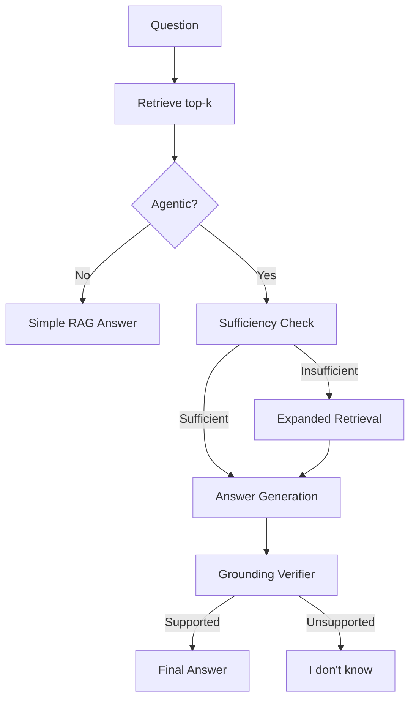
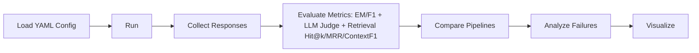

# Additional Diagrams

## Agent Flow Diagram

```mermaid
flowchart TD
    A[Question] --> B[Retrieve top-k]
    B --> C{Agentic?}
    C -->|No| D[Simple RAG Answer]
    C -->|Yes| E[Sufficiency Check]
    E -->|Sufficient| F[Answer Generation]
    E -->|Insufficient| G[Expanded Retrieval]
    G --> F
    F --> H[Grounding Verifier]
    H -->|Supported| I[Final Answer]
    H -->|Unsupported| J[I don't know]
```

## Evaluation Flow Diagram

```mermaid
flowchart LR
    CFG[Load YAML Config] --> R[Run]
    R[Run] --> C[Collect Responses]
    C --> E[Evaluate Metrics: EM/F1 + LLM Judge + Retrieval Hit@k/MRR/ContextF1]
    E --> P[Compare Pipelines]
    P --> A[Analyze Failures]
    A --> V[Visualize]
```
