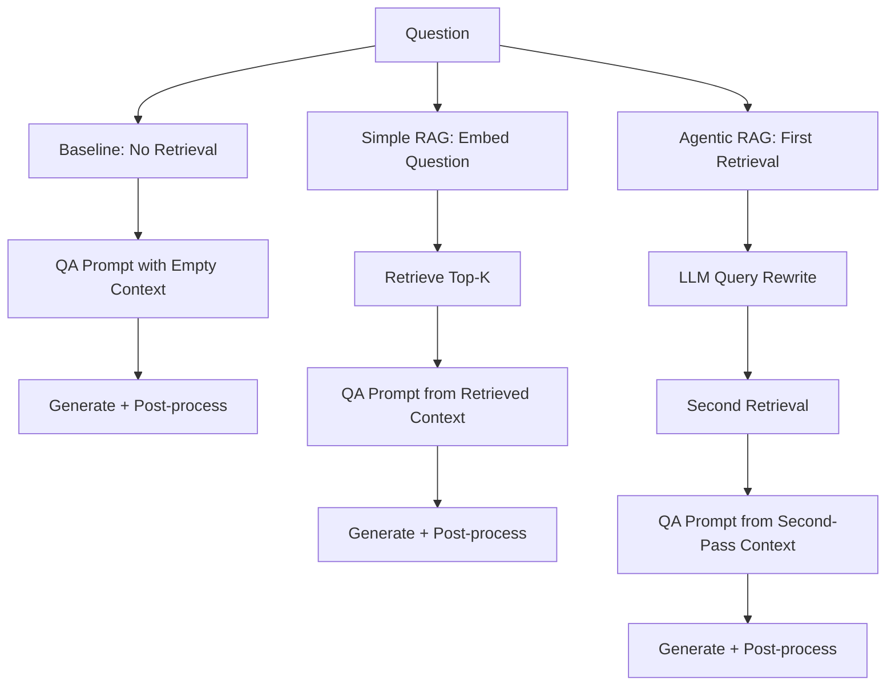
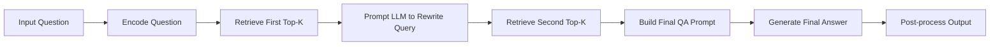

# Flowcharts

## End-to-End Benchmark Flow

```mermaid
flowchart LR
    A[Parse CLI Args] --> B[Load YAML Config]
    B --> C[Resolve Dataset + Limits]
    C --> D[Load JSONL Questions Context Answers]
    D --> E[Build or Reuse Chroma Collection]
    E --> F[Compute Retrieval Metrics]
    F --> G[Run Baseline]
    G --> H[Run Simple RAG]
    H --> I[Run Agentic RAG]
    I --> J[Evaluate EM F1 Judge Scores]
    J --> K[Write CSV Reports and Response Files]
    K --> L[Write Failure Analysis]
    L --> M[Render Charts]
```

## Pipeline Comparison Flow

## Agentic RAG Internal Flow

## Config Presets

- `configs/experiment1.yaml`: `llama3.2:1b`, BGE-large embedding, strict context-only.
- `configs/experiment2.yaml`: `mistral:latest`, BGE-large embedding, relaxed context policy.
- `configs/benchmark.low_budget.yaml`: 10-query smoke test, MiniLM embedding, relaxed context policy.
