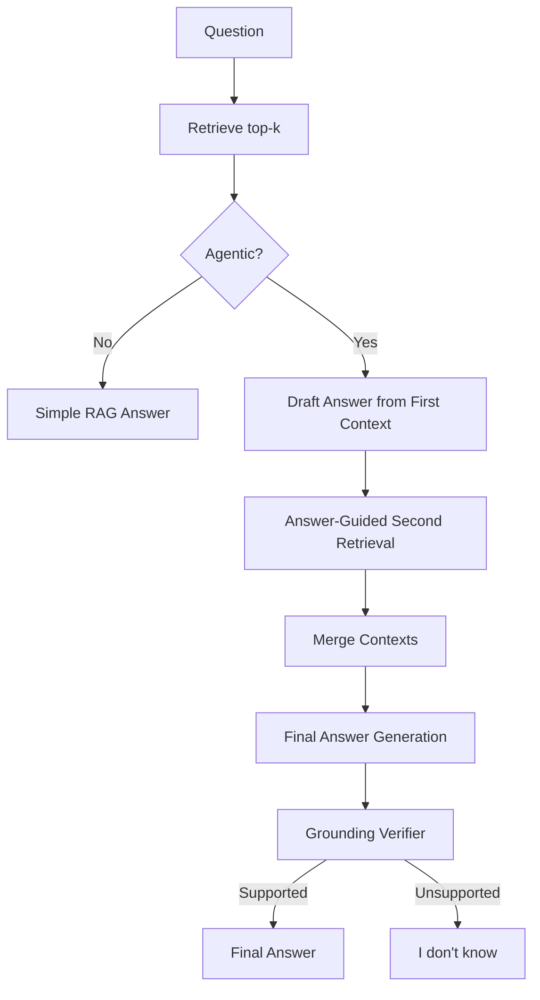
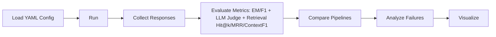

# Additional Diagrams

## Agent Flow Diagram

## Evaluation Flow Diagram

## Experiment2 Note

Experiment2 enables `answering.strict_context_only: false` so the agentic pipeline can draft a best-effort answer before the verification pass.
